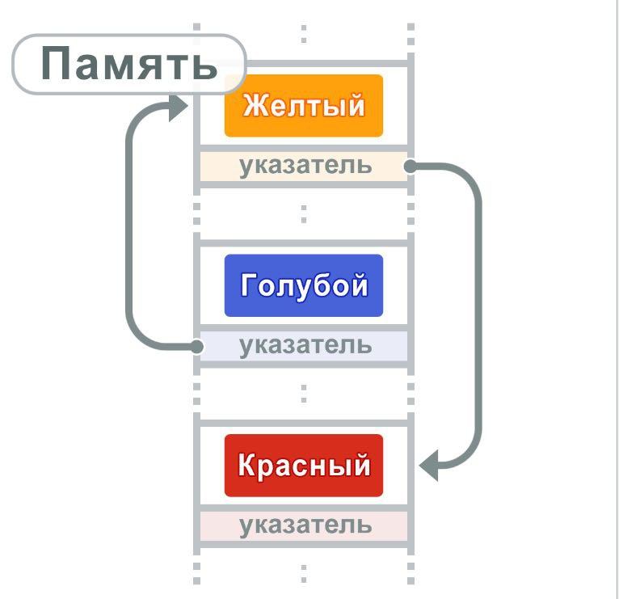
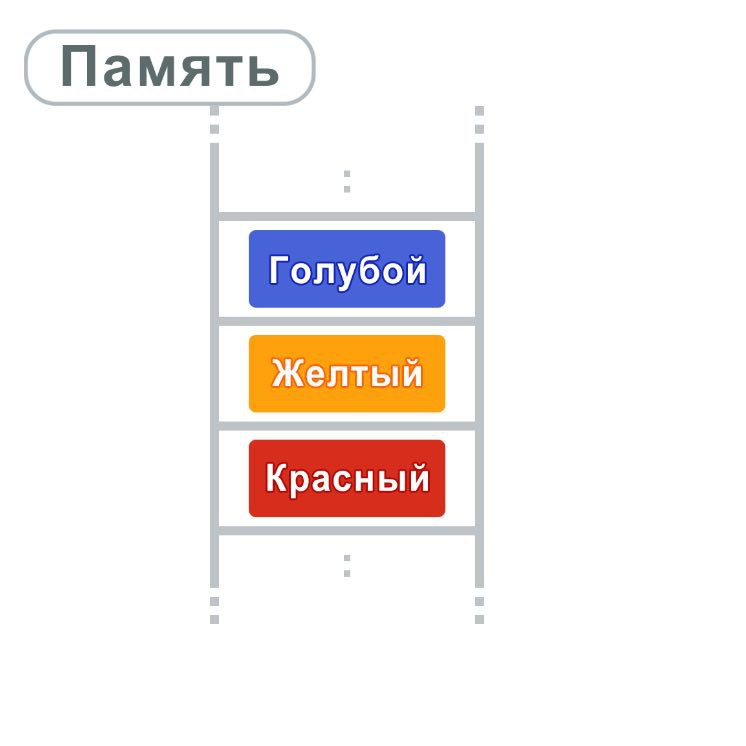

## Алгоритмы и структуры данных

### Списки

Списки - это тип структуры данных, который позволяет хранить разные значения.  
Списки связывают данные с помощью указателей. Указатели указывают на следующую 
порцию данных.

В списках данные хранятся в различных, не связанных между собой областях памяти

Так как данные располагаются в различных местах памяти, то доступ может быть 
только через указатели

<b>Задачи:</b>

### Массивы

Массивы - это тип структуры данных, позволяющий хранить несколько значений.  
Каждый элемент доступен через его индекс, который означает положение элемента
в массиве. Данные хранятся в памяти последовательно

Так как данные располагаются последовательно, адреса в памяти вычисляются с помощью индексов, 
позволяя организовать произвольный доступ к данным. Но массивы имеют свои минусы, такие как
высокая стоимость добавления или удаления данных по сравнению со списками

<b>Задачи:</b>

