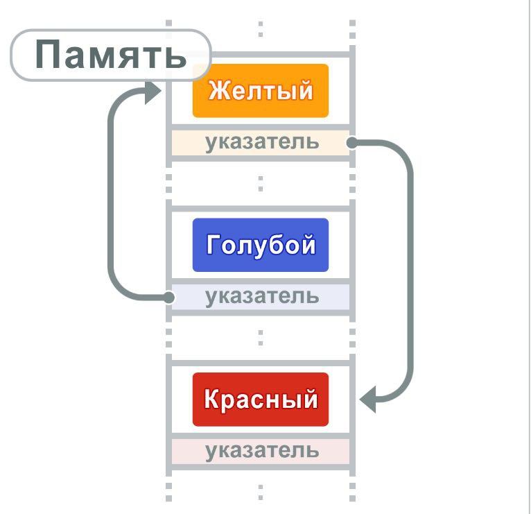
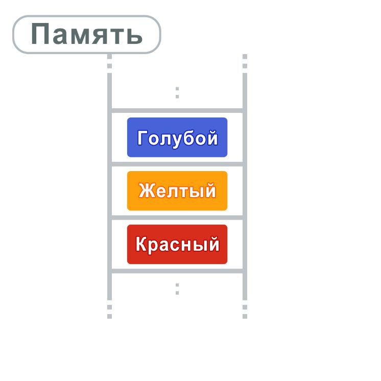

## Алгоритмы и структуры данных

### Списки

Списки - это тип структуры данных, который позволяет хранить разные значения.  
Списки связывают данные с помощью указателей. Указатели указывают на следующую 
порцию данных.

В списках данные хранятся в различных, не связанных между собой областях памяти



Так как данные располагаются в различных местах памяти, то доступ может быть 
только через указатели

### Массивы

Массивы - это тип структуры данных, позволяющий хранить несколько значений.  
Каждый элемент доступен через его индекс, который означает положение элемента
в массиве. Данные хранятся в памяти последовательно



Так как данные располагаются последовательно, адреса в памяти вычисляются с помощью индексов, 
позволяя организовать произвольный доступ к данным. Но массивы имеют свои минусы, такие как
высокая стоимость добавления или удаления данных по сравнению со списками

### Хеш-таблицы

Хеш-таблицы - это разновидность структур данных, подходящие для хранения данных в наборах, 
состоящих из **ключей** и **значений**

### Задачи

<details>
<summary><b>Arrays and hashing:</b></summary>

<details>
<summary><b>217. Contains-duplicate:</b></summary>

https://leetcode.com/problems/contains-duplicate/


Time: O(nlog(n)); Space: O(1)
```python
class Solution:
    def containsDuplicate(self, nums: List[int]) -> bool:
        nums = sorted(nums)

        for n in range(len(nums) - 1):
            if nums[n] == nums[n+1]:
                return True
        return False
```

Time: O(n); Space: O(n)
```python
class Solution:
    def containsDuplicate(self, nums: List[int]) -> bool:
        hashset = set ()

        for n in nums:
            if n in hashset:
                return True
            
            hashset.add(n)
        return False
```
</details>

<details>
<summary><b>242. Valid Anagram</b></summary>


Time: O(n); Space: O(n);
```python
class Solution:
    def isAnagram(self, s: str, t: str) -> bool:
        '''
        Пройдемся по каждому символу в строке, каждый уникальный символ будем добавлять в качестве ключа,
        если символ уже находится в словаре, то увеличиваем счетчик
        Выполняем для двух строк
        Сравниваем словари
        '''
        if len(s) != len(t):
            return False
        
        countS, countT = {}, {}

        for i in range(len(s)):
            countS[s[i]] = 1 + countS.get(s[i], 0)
            countT[t[i]] = 1 + countT.get(t[i], 0)            
        
        for c in countS:
            if countS[c] != countT.get(c, 0):
                return False
        
        return True
```

Time: O(nlog(n)); Space: O(nlog(n));
```python
class Solution:
    def isAnagram(self, s: str, t: str) -> bool:
        return sorted(s) == sorted(t)
        
```
</details>

<details>
<summary><b>1. Two Sum</b></summary>


</details>

<details>
<summary><b></b></summary>

</details>

</details>


