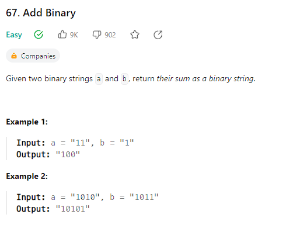
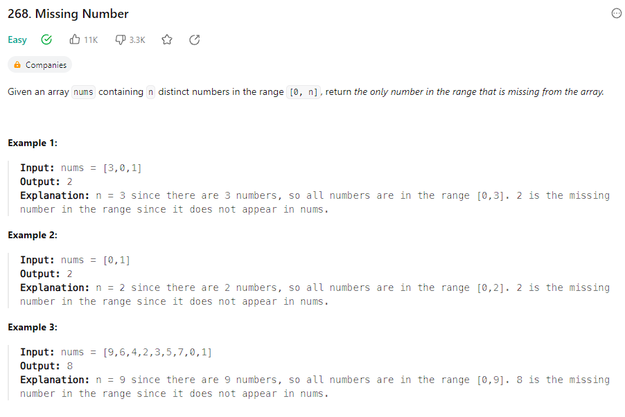
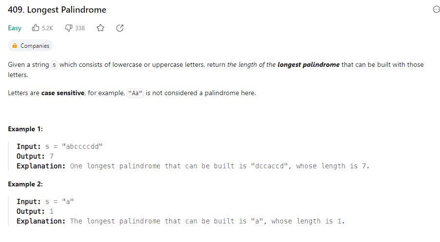
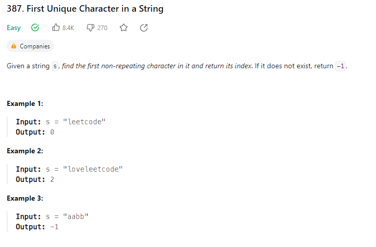

## Алгоритмы и структуры данных

### Задачи

<details>
<summary><b>Arrays and hashing:</b></summary>  
<br>

<details>
<summary><b>217. Contains-duplicate:</b></summary>

https://leetcode.com/problems/contains-duplicate/


Time: O(nlog(n)); Space: O(1)
```python
class Solution:
    def containsDuplicate(self, nums: List[int]) -> bool:
        nums = sorted(nums)

        for n in range(len(nums) - 1):
            if nums[n] == nums[n+1]:
                return True
        return False
```

Time: O(n); Space: O(n)
```python
class Solution:
    def containsDuplicate(self, nums: List[int]) -> bool:
        hashset = set ()

        for n in nums:
            if n in hashset:
                return True
            
            hashset.add(n)
        return False
```
</details>

<details>
<summary><b>242. Valid Anagram</b></summary>


Time: O(n); Space: O(n);
```python
class Solution:
    def isAnagram(self, s: str, t: str) -> bool:
        '''
        Пройдемся по каждому символу в строке, каждый уникальный символ будем добавлять в качестве ключа,
        если символ уже находится в словаре, то увеличиваем счетчик
        Выполняем для двух строк
        Сравниваем словари
        '''
        if len(s) != len(t):
            return False
        
        countS, countT = {}, {}

        for i in range(len(s)):
            countS[s[i]] = 1 + countS.get(s[i], 0)
            countT[t[i]] = 1 + countT.get(t[i], 0)            
        
        for c in countS:
            if countS[c] != countT.get(c, 0):
                return False
        
        return True
```

Time: O(nlog(n)); Space: O(nlog(n));
```python
class Solution:
    def isAnagram(self, s: str, t: str) -> bool:
        return sorted(s) == sorted(t)
        
```
</details>

<details>
<summary><b>1. Two Sum</b></summary>


Time: O(n); Space: O(n);
```python
class Solution:
    def twoSum(self, nums: List[int], target: int) -> List[int]:
        '''
        Создадим словарь с парой число:индекс_числа
        Проиндекстируем список nums
        Найдем разницу между target и числом
        Если число размером в разницу есть в словаре, то возвращаем результат
        Иначе добавляем число в словарь   
        '''
        hashmap = {}  # value : index

        for k, v in enumerate(nums):
            diff = target - v
            if diff in hashmap:
                return [hashmap[diff], k]
            hashmap[v] = k
```
</details>

<details>
<summary><b>49. Group Anagrams</b></summary>


Time: O(n * k * log(k)); Space: O(n);
```python
class Solution:
    def groupAnagrams(self, strs: List[str]) -> List[List[str]]:
        anagram_dict = defaultdict(list)
        
        for i, word in enumerate(strs):
            sorted_word = ''.join(sorted(word))
            anagram_dict[sorted_word].append(word)

        return list(anagram_dict.values())
```
</details>

<details>
<summary><b>347. Top K Frequent Elements</b></summary>


Time: O(n * k * log(k)); Space: O(n);
```python
class Solution:
    def topKFrequent(self, nums: List[int], k: int) -> List[int]:
        # Используем Counter для подсчета частоты элементов
        num_count = Counter(nums)

        # Сортируем элементы по частоте в убывающем порядке
        sorted_nums = sorted(num_count, key=lambda x: num_count[x], reverse=True)

        # Возвращаем первые k элементов
        return sorted_nums[:k]
```
</details>

<details>
<summary><b>605. Can Place Flowers</b></summary>


Time: O(n); Space: O(1);
```python
class Solution:
    def canPlaceFlowers(self, flowerbed: List[int], n: int) -> bool:
        length = len(flowerbed)
        i = 0

        while i < length:
            if flowerbed[i] == 0:
                if i == length - 1 or flowerbed[i + 1] == 0:
                    n -= 1
                    i += 2  # пропускаем два элемента, так как они не могут влиять на посадку цветка
                else:
                    i += 3  # пропускаем три элемента, так как следующий элемент занят
            else:
                i += 2  # пропускаем два элемента, так как текущий элемент уже занят

            if n <= 0:
                return True

        return False
```
</details>

<details>
<summary><b>941. Valid Mountain Array</b></summary>


Time: O(n); Space: O(1);
```python
class Solution:
    def validMountainArray(self, arr: List[int]) -> bool:
        l = len(arr)

        if l < 3:
            return False
        
        i = 0
        while arr[i] < arr[i+1]:
            i += 1 
            if i == l - 1:
                return False  
        
        j = l-1
        while arr[j-1] > arr[j]:
            j -= 1
            if j == 0:
                return False 
        
        return i == j
```
</details>

<details>
<summary><b>228. Summary Ranges</b></summary>


Time: O(n); Space: O(1);
```python
class Solution:
    def summaryRanges(self, nums: List[int]) -> List[str]:
        i = 0
        j = 0
        res = []

        while j <= len(nums) - 1:
            start = nums[i]

            while j < len(nums) - 1 and nums[j + 1] - nums[j] == 1:
                j += 1

            finish = nums[j]

            if start == finish:
                res.append(str(start))
            else:
                res.append(str(start) + "->" + str(finish))

            i = j + 1
            j += 1
        return res
```
</details>

<details>
<summary><b>1431. Kids With the Greatest Number of Candies</b></summary>


Time: O(n); Space: O(n);
```python
class Solution:
    def kidsWithCandies(self, candies: List[int], extraCandies: int) -> List[bool]:
        return [candy + extraCandies >= max(candies) for candy in candies]
```
</details>

<details>
<summary><b>674. Longest Continuous Increasing Subsequence</b></summary>


Time: O(n); Space: O(n);

```python
class Solution:
    def findLengthOfLCIS(self, nums: List[int]) -> int:
        if not nums:
            return 0

        res = [1]
        f = 1

        for i in range(1, len(nums)):
            if nums[i] > nums[i - 1]:
                res.append(res[-1] + 1)
            else:
                res.append(1)

        return max(res)
```
</details>

<details>
<summary><b>1480. Running Sum of 1d Array</b></summary>


Time: O(n); Space: O(1);

```python
class Solution:
    def runningSum(self, nums: List[int]) -> List[int]:
        for i in range(1, len(nums)):
            nums[i] += nums[i-1]
        return nums
```
</details>

<details>
<summary><b>896. Monotonic Array</b></summary>


Time: O(n); Space: O(1);

```python
class Solution:
    def isMonotonic(self, nums: List[int]) -> bool:
        i = 0
        while i < len(nums) - 1 and nums[i] <= nums[i+1]:
            i += 1
        
        j = 0
        while j < len(nums) - 1 and nums[j] >= nums[j+1]:
            j += 1
        
        return any([i == len(nums) - 1, j == len(nums) - 1])
```
</details>
<br>
</details>

<details>
<summary><b>Binary Search:</b></summary>
<br>
<details>
<summary><b>367. Valid Perfect Square</b></summary>


Time: O(1); Space: O(1);

```python
class Solution:
    def isPerfectSquare(self, num: int) -> bool:
        return num % num ** 0.5 == 0
```

Time: O(log(n)); Space: O(1);
```python
class Solution:
    def isPerfectSquare(self, num: int) -> bool:
        l, r = 1, num // 2

        if num == 1:
            return True

        while l <= r:
            mid = (l + r ) // 2
            
            if mid ** 2 == num:
                return True
            
            if mid ** 2 > num:
                r = mid - 1
            else:
                l = mid + 1
        
        return False
```
</details>

<details>
<summary><b>704. Binary Search</b></summary>


Time: O(log(n)); Space: O(1);

```python
class Solution:
    def search(self, nums: List[int], target: int) -> int:
        l, r = 0, len(nums) - 1

        while l <= r:
            mid = (r + l) // 2

            if nums[mid] == target:
                return mid
            elif nums[mid] < target:
                l = mid + 1
            else:
                r = mid

        return -1
```
</details>

<details>
<summary><b>69. Sqrt(x)</b></summary>


Time: O(log(n)); Space: O(1);

```python
class Solution:
    def mySqrt(self, x: int) -> int:
        l, r = 1, x

        while l <= r:
            mid = (l + r) // 2

            if mid * mid == x:
                return int(mid)
            
            if mid * mid < x:
                l = mid + 1
            else:
                r = mid - 1

        return r
```
</details>

<details>
<summary><b>278. First Bad Version</b></summary>


Time: O(log(n)); Space: O(1);

```python
# The isBadVersion API is already defined for you.
# def isBadVersion(version: int) -> bool:

class Solution:
    def firstBadVersion(self, n: int) -> int:
        l, r = 0, n
        
        while l <= r:
            mid = (l + r) // 2

            if isBadVersion(mid) == False:
                l = mid + 1
            else:
                r = mid - 1
            
            if isBadVersion(mid-1) == False and isBadVersion(mid) == True:
                return mid
```
</details>

<details>
<summary><b>374. Guess Number Higher or Lower</b></summary>


Time: O(log(n)); Space: O(1);

```python
# The guess API is already defined for you.
# @param num, your guess
# @return -1 if num is higher than the picked number
#          1 if num is lower than the picked number
#          otherwise return 0
# def guess(num: int) -> int:

class Solution:
    def guessNumber(self, n: int) -> int:
        l, r = 1, n

        while l <= r:
            mid = (l + r) // 2
            g = guess(mid)
            
            if g == 0:
                return mid
            elif g > 0:
                l = mid + 1
            else:
                r = mid - 1

        return r
```
</details>

<details>
<summary><b>35. Search Insert Position</b></summary>


Time: O(log(n)); Space: O(1);

```python
class Solution:
    def searchInsert(self, nums: List[int], target: int) -> int:
        l, r = 0, len(nums) - 1
        if len(nums) == 1 and nums[0] < target:
            return 1

        while l < r:
            mid = (l + r) // 2

            if nums[mid] == target:
                return mid
            elif nums[mid] < target:
                l = mid + 1
            else:
                r = mid

            if nums[-1] < target:
                return len(nums)
            elif nums[0] > target:
                return 0

        return r
```
</details>

<details>
<summary><b>852. Peak Index in a Mountain Array</b></summary>


Time: O(log(n)); Space: O(1);

```python
class Solution:
    def peakIndexInMountainArray(self, arr: List[int]) -> int:
        l, r = 0, len(arr) - 1

        while l <= r:
            mid = (l + r) // 2

            if arr[mid - 1] < arr[mid] > arr[mid + 1]:
                return mid

            if arr[mid - 1] < arr[mid]:
                l = mid + 1
            else:
                r = mid
```
</details>
<br>
</details>

<details>
<summary><b>Bitwise</b></summary><br>
<br>
<details>
<summary><b>338. Counting Bits</b></summary>


Time: O(n * log(n)); Space: O(1);

```python
class Solution:
    def countBits(self, n: int) -> List[int]:
        # ans = [bin(i)[2:].count('1') for i in range(n+1)]

        ans = [0]

        for i in range(1, n + 1):
            current = 0

            while i:
                current += i & 1
                i >>= 1
            ans.append(current)

        return ans
```
</details>

<details>
<summary><b>136. Single Number</b></summary>


Time: O(n); Space: O(1);

```python
class Solution:
    def singleNumber(self, nums: List[int]) -> int:
        ans = 0
        
        for num in nums:
            ans = ans ^ num
        
        return ans
```
</details>

<details>
<summary><b>461. Hamming Distance</b></summary>


Time: O(log(n)); Space: O(1);

```python
class Solution:
    def hammingDistance(self, x: int, y: int) -> int:

        ans = 0

        while x or y:

            ans += (x & 1) != (y & 1)
            x >>= 1
            y >>= 1

        return ans
```
</details>

<details>
<summary><b>191. Number of 1 Bits</b></summary>


Time: O(n); Space: O(1);

```python
class Solution:
    def hammingWeight(self, n: int) -> int:

        count = 0

        while n:
            
            count += n & 1
            n >>= 1
        
        return count
```
</details>
<br>
</details>

<details>
<summary><b>Divmod</b></summary><br>
<br>

<details>
<summary><b>9. Palindrome Number</b></summary>


Time: O(log(n)); Space: O(1);

```python
class Solution:
    def isPalindrome(self, x: int) -> bool:
        if x < 0:
            return False

        num = 0
        orig = x

        while x:
            x, digit = divmod(x, 10)  # Берем последнюю цифру числа

            num = num * 10 + digit  # Пересобираем число справа налево
        
        return num == orig
```
</details>

<details>
<summary><b>258. Add Digits</b></summary>


Time: O(log(n)); Space: O(1);

```python
class Solution:
    def addDigits(self, num: int) -> int:
        new = 0

        while num:
            num, digit = divmod(num, 10)

            new = new + digit

        if new > 9:
            return self.addDigits(new)

        return new
```
</details>

<details>
<summary><b>66. Plus One</b></summary>


Time: O(n); Space: O(1);

```python
class Solution:
    def plusOne(self, digits: List[int]) -> List[int]:
        carry = 1

        for i in range(len(digits)-1, -1, -1):

            carry, digits[i] = divmod(carry+digits[i], 10)

            if carry == 0:
                break

        return digits if not carry else [carry] + digits
```
</details>

<details>
<summary><b>67. Add Binary</b></summary>



Time: O(n); Space: O(1);

```python
class Solution:
    def addBinary(self, a: str, b: str) -> str:
        # res = bin(int(a, 2) + int(b, 2))
        # return res[2:]

        la, lb = len(a), len(b)

        # Уравняем длину строк
        if la > lb:
            b = '0' * (la - lb) + b
        else:
            a = '0' * (lb - la) + a

        carry = 0
        ans = ''

        for i in range(len(a)-1, -1, -1):
            d1 = int(a[i])
            d2 = int(b[i])

            carry, d = divmod(d1 + d2 + carry, 2)

            ans += str(d)
        
        if carry:
            ans += str(carry)
        
        return ans[::-1]
```
</details>
<br>
</details>

<details>
<summary><b>Dynamic Programming</b></summary><br>
<br>

<details>
<summary><b>1137. N-th Tribonacci Number</b></summary>


Time: O(n); Space: O(n);

```python
class Solution:
    def tribonacci(self, n: int) -> int:
        dp = [0, 1, 1]

        if n < 3:
            return dp[n]

        for i in range(3, n+1):
            dp.append(dp[i-3] + dp[i-2] + dp[i-1])
        
        return dp[-1]
```
</details>

<details>
<summary><b>509. Fibonacci Number</b></summary>


Time: O(n); Space: O(1);

```python
class Solution:
    @lru_cache(None)
    def fib(self, n: int) -> int:
        if n < 2:
            return n
        return self.fib(n-1) + self.fib(n-2)

    # def fib(self, n: int) -> int:
    #     if n < 2:
    #         return n

    #     n0, n1 = 0, 1
    #     for i in range(2, n + 1):
    #         cur = n0 + n1
    #         n0, n1 = n1, cur
    #     return cur
```
</details>

<details>
<summary><b>118. Pascal's Triangle</b></summary>


Time: O(n * k); Space: O(n * k);

```python
class Solution:
    def generate(self, numRows: int) -> List[List[int]]:
        dp = [[1], [1, 1]]

        if numRows < 3:
            return dp[:numRows]

        for _ in range(numRows-2):

            step = [1]  # Добавляем во внутренний список 1 в начало

            # Считаем суммы соседних элементов и вставляем их между соседями
            for i in range(1, len(dp[-1])):
                step.append(dp[-1][i] + dp[-1][i-1])
            
            step += [1]  # Добавляем во внутренний список 1 в конец
            dp.append(step)
            
        return(dp)
```
</details>

<details>
<summary><b>485. Max Consecutive Ones</b></summary>


Time: O(n); Space: O(n);

```python
class Solution:
    def findMaxConsecutiveOnes(self, nums: List[int]) -> int:

        dp = [0] * (len(nums) + 1)

        for i in range(len(nums)):
            if nums[i]:
                dp[i + 1] = dp[i] + 1
            else:
                dp[i + 1] = 0

        return max(dp)
```
</details>
<br>
</details>

<details>
<summary><b>Hash</b></summary>
<br>

<details>
<summary><b>929. Unique Email Addresses</b></summary>


Time: O(n * k); Space: O(n * k);

```python
class Solution:
    def numUniqueEmails(self, emails: List[str]) -> int:
        hashset = set()

        for e in emails:

            localname, domain = e.split('@')
            
            localname = localname.split('+')[0].replace('.', '')

            hashset.add(f'{localname}@{domain}')

        return len(hashset) 
```
</details>

<details>
<summary><b>1346. Check If N and Its Double Exist</b></summary>


Time: O(n); Space: O(n);

```python
class Solution:
    def checkIfExist(self, arr: List[int]) -> bool:
        
        hashset = set()

        for num in arr:

            if num * 2 in hashset or num / 2 in hashset:
                return True
            hashset.add(num)
        
        return False    
```
</details>

<details>
<summary><b>389. Find the Difference</b></summary>


Time: O(n); Space: O(n);

```python
class Solution:
    def findTheDifference(self, s: str, t: str) -> str:
        # res = Counter(t) - Counter(s)
        # return list(res.keys())[0]

        count_s = {}

        for char in s:
            count_s[char] = count_s.get(char, 0) + 1
        
        for char in t:
            if char not in count_s or count_s[char] == 0:
                return char
            
            count_s[char] -= 1
        
        return None
```
</details>

<details>
<summary><b>268. Missing Number</b></summary>



Time: O(n); Space: O(n);

```python
class Solution:
    def missingNumber(self, nums: List[int]) -> int:
        # nums = sorted(nums)
        # if nums[0] != 0:
        #     return 0

        # for i in range(len(nums) - 1):
        #     if not nums[i] + 1 == nums[i + 1]:
        #         return nums[i] + 1
        
        # return nums[-1] + 1
        
        return list(set(range(len(nums)+1)) - set(nums))[0] 
```
</details>

<details>
<summary><b>169. Majority Element</b></summary>


Time: O(n); Space: O(n);

```python
class Solution:
    def majorityElement(self, nums: List[int]) -> int:
        counter = Counter(nums)

        for k, v in counter.items():
            if v == max(counter.values()):
                return k
```
</details>

<details>
<summary><b>409. Longest Palindrome</b></summary>



Time: O(n); Space: O(n);

```python
class Solution:
    def longestPalindrome(self, s: str) -> int:
        hashset = {}

        for char in s:
            hashset[char] = hashset.get(char, 0) + 1

        res = 0

        for k, v in hashset.items():
            cur = v - (v % 2)
            res += cur
            hashset[k] -= cur
        
        return res if not sum(hashset.values()) else res + 1
```
</details>

<details>
<summary><b>205. Isomorphic Strings</b></summary>


Time: O(n); Space: O(n);

```python
class Solution:
    def isIsomorphic(self, s: str, t: str) -> bool:
        ds, dt = {}, {}
        
        for i in range(len(s)):
            
            if s[i] in ds:
                if ds[s[i]] != t[i]:
                    return False
            else:
                if t[i] in dt and dt[t[i]] != s[i]:
                    return False
                else: 
                    ds[s[i]] = t[i]
                    dt[t[i]] = s[i]

        return True
```
</details>

<details>
<summary><b>349. Intersection of Two Arrays</b></summary>


Time: O(n); Space: O(n);

```python
class Solution:
    def intersection(self, nums1: List[int], nums2: List[int]) -> List[int]:
        return list(set(nums1) & set(nums2))
```
</details>

<details>
<summary><b>448. Find All Numbers Disappeared in an Array</b></summary>


Time: O(n); Space: O(n);

```python
class Solution:
    def findDisappearedNumbers(self, nums: List[int]) -> List[int]:
        return set(range(1, len(nums)+1)) - set(nums)
```
</details>

<details>
<summary><b>771. Jewels and Stones</b></summary>


Time: O(n); Space: O(n);

```python
class Solution:
    def numJewelsInStones(self, jewels: str, stones: str) -> int:

        jset = set(jewels)

        jewels_count = 0

        for i in stones:
            if i in jset:
                jewels_count += 1
        
        return jewels_count
```
</details>

<details>
<summary><b>387. First Unique Character in a String</b></summary>



Time: O(n); Space: O(n);

```python
class Solution:
    def firstUniqChar(self, s: str) -> int:
        hashset = {}

        for i in s:
            hashset[i] = hashset.get(i, 0) + 1
        
        for i, v in enumerate(s):
            if hashset[v] == 1:
                return i
        
        return -1
```
</details>

<details>
<summary><b>383. Ransom Note</b></summary>


Time: O(n); Space: O(n);

```python
class Solution:
    def canConstruct(self, ransomNote: str, magazine: str) -> bool:
        counter = Counter(magazine)

        for char in ransomNote:
            if char in counter and counter[char] > 0:
                counter[char] -= 1
            else:
                return False

        return True
```
</details>

<details>
<summary><b>202. Happy Number</b></summary>


Time: O(log(n)); Space: O(log(n));

```python
class Solution:
    def isHappy(self, n: int) -> bool:
        seen = set()

        while n != 1 and n not in seen:
            seen.add(n)

            new = 0

            while n:
                n, digit = divmod(n, 10)
                new += digit ** 2
            
            n = new
        
        return n == 1
```
</details>

<details>
<summary><b>350. Intersection of Two Arrays II</b></summary>


Time: O(m + n); Space: O(m + n);

```python
class Solution:
    def intersect(self, nums1: List[int], nums2: List[int]) -> List[int]:
        # c = Counter(nums1) & Counter(nums2)
        # return list(c.elements())
        
        hashset1, hashset2 = {}, {}
        result = []

        for i in nums1:
            hashset1[i] = hashset1.get(i, 0) + 1

        for j in nums2:
            hashset2[j] = hashset2.get(j, 0) + 1

        for key in hashset1.keys():
            if key in hashset2:
                result.extend([key] * min(hashset1[key], hashset2[key]))

        return result
```
</details>

<br>
</details>

<details>
<summary><b>Linked list</b></summary>
<br>

<details>
<summary><b>206. Reverse Linked List</b></summary>


Time: O(n); Space: O(1);

```python
# Definition for singly-linked list.
# class ListNode:
#     def __init__(self, val=0, next=None):
#         self.val = val
#         self.next = next
class Solution:
    def reverseList(self, head: Optional[ListNode]) -> Optional[ListNode]:
        previous, current = None, head

        while current:
            nxt = current.next
            current.next = previous
            previous = current
            current = nxt

        return previous
```
</details>

<details>
<summary><b></b></summary>


Time: O(n); Space: O(1);

```python
# Definition for singly-linked list.
# class ListNode:
#     def __init__(self, val=0, next=None):
#         self.val = val
#         self.next = next
class Solution:
    def removeElements(self, head: Optional[ListNode], val: int) -> Optional[ListNode]:
        
        dummy = ListNode(None, head)
        current = head
        previous = dummy

        while current:
            
            if current.val == val:
                previous.next = current.next
            else:
                previous = current
            
            current = current.next

        return dummy.next

```
</details>

<details>
<summary><b>21. Merge Two Sorted Lists</b></summary>


Time: O(n+m); Space: O(1);

```python
# Definition for singly-linked list.
# class ListNode:
#     def __init__(self, val=0, next=None):
#         self.val = val
#         self.next = next

class Solution:
    def mergeTwoLists(self, list1: Optional[ListNode], list2: Optional[ListNode]) -> Optional[ListNode]:
        dummy = ListNode(None)
        tail = dummy


        while list1 and list2:
            if list1.val < list2.val:
                tail.next = list1
                list1 = list1.next
            else:
                tail.next = list2
                list2 = list2.next
            tail = tail.next
        
        if list1:
            tail.next = list1
        elif list2:
            tail.next = list2

        return dummy.next
```
</details>

<details>
<summary><b>876. Middle of the Linked List</b></summary>


Time: O(n); Space: O(1);

```python
# Definition for singly-linked list.
# class ListNode:
#     def __init__(self, val=0, next=None):
#         self.val = val
#         self.next = next
class Solution:
    def middleNode(self, head: Optional[ListNode]) -> Optional[ListNode]:
        slow = head 
        fast = head

        while fast and fast.next:
            slow = slow.next
            fast = fast.next.next
        
        return slow
```
</details>

<details>
<summary><b>141. Linked List Cycle</b></summary>


Time: O(n); Space: O(1);

```python
# Definition for singly-linked list.
# class ListNode:
#     def __init__(self, x):
#         self.val = x
#         self.next = None

class Solution:
    def hasCycle(self, head: Optional[ListNode]) -> bool:
        # seen = set()

        # while head:
        #     if head in seen:
        #         return True
            
        #     seen.add(head)
        #     head = head.next
        # return False
        
        if not head:
            return False

        slow = head
        fast = head.next

        while fast and fast.next:
            if slow == fast:
                return True

            slow = slow.next
            fast = fast.next.next
        
        return False
```
</details>

<details>
<summary><b></b></summary>


Time: O(); Space: O();

```python

```
</details>

<br>
</details>


###############################

<details>
<summary><b></b></summary>
<br>

<details>
<summary><b></b></summary>


Time: O(); Space: O();

```python

```
</details>


<br>
</details>


